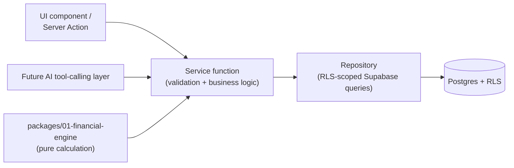

# AI Assistant Architecture — Building for P15 Without Building P15

**Status:** Standing architectural record, permanent as of 2026-08-06.
Required reading before designing any package from P4 onward. **The
assistant described here is not implemented by this document or by any
package before P15.** This document exists so that P4 through P14 are
each built in a shape the assistant can plug into later without a
refactor — the constraint side of this lives in
`TARGET-ARCHITECTURE.md` §14; this document is the assistant's own
eventual design plus the reasoning behind the constraint.

## Why this exists now, four packages before P15 would ever start

Retrofitting "an AI can safely use this" onto a system after the fact
usually means one of two bad outcomes: either the assistant gets a
service-role client "just to see everything," quietly breaking every
RLS guarantee this schema was built around, or every package's business
logic gets rewritten a second time so the assistant has something
callable. Both are avoidable by deciding now, while only three packages
(P0, P1, P2.1) exist, that **the assistant is not a separate system —
it is another caller of the same repository/service layer the UI
already needs.** Stated as the project's own ambition: the assistant
should eventually be the portal's natural interface, not a chatbot
bolted onto the side of it. That's only possible if there's one
business-logic layer for both to share, from the start.

## The core pattern: repository (reads) + service (writes) + thin adapters

- **Repository** — read-only data access, RLS-scoped to the calling
  user's own session. `FinancialRepository`
  (`packages/02-app-shell/src/data/financialRepository.ts`) is the
  existing model: `getCostCodes`, `getBudgetLedger`, `getExpenses`, etc.
  Every future domain gets its own (`DocumentRepository`,
  `ScheduleRepository`, `ChangeOrderRepository`, `SelectionRepository`,
  `ConversationRepository`, `VendorRepository`, `CommitmentRepository`).
- **Service function** — plain TypeScript, validation plus the actual
  mutation (an insert/update through the repository, or a call to an
  RPC for cases needing transactional atomicity, per
  `TARGET-ARCHITECTURE.md` §5.2). `P4-DESIGN.md`'s
  `enterOriginalBudget`/`adjustBudget`/`confirm_import_batch` are the
  first instances of this pattern applied to a real package.
- **Thin adapter** — a Server Action (today) or a future AI tool
  definition (P15) that parses its specific input shape (`FormData` for
  a Server Action, a structured tool-call argument for the assistant)
  and calls the service function. Neither adapter contains business
  logic; both are replaceable without touching the service function
  they call.
- **The financial engine** (`packages/01-financial-engine`) sits
  beside, not inside, any single service — it's already
  framework-agnostic pure logic, which is exactly why the assistant can
  call it directly for narration (see "Grounding" below) without a
  wrapper.

**This is not a new abstraction layer being proposed for its own
sake** — `FinancialRepository` already exists and already follows this
shape. The change this document makes permanent is: every *future*
package follows it too, deliberately, rather than each one deciding
independently whether to bother.

## Authorization: the assistant is not a new trust boundary

Whenever P15 is built, its Route Handler (`/api/assistant/chat` or
similar) authenticates the requesting user exactly as every other
Route Handler does today (`createServerSupabaseClient()`, cookie-based,
that user's own JWT) and passes that same client into every
repository/service call its tool-calling layer makes. A vendor asking
"what's the total project budget" gets back whatever
`is_project_vendor()`-scoped RLS already permits — which today is
nothing on `budget_ledger` (P3's vendor foundation deliberately grants
vendors visibility into their own `project_members` row only, nothing
else, per `TARGET-ARCHITECTURE.md` §3). The assistant doesn't need a
special case to refuse that question; RLS already refuses the
underlying query, and the assistant simply reports what it got back
(nothing) rather than being told in a prompt not to answer.

**No AI-specific service account, ever.** If a future capability
genuinely needs data no single user's RLS would return (e.g., a
cross-project company-wide summary for an Owner), that's an ordinary
Owner-only privileged operation already covered by
`TARGET-ARCHITECTURE.md` §5.2's enumerated service-role cases — reached
through the *Owner's own* elevated role check, not a blanket exemption
for anything the assistant asks.

## Grounding: the assistant narrates real numbers, it never computes them

Every financial explanation the assistant will eventually give follows
one rule: call the real repository/engine function first, then narrate
*that specific return value*. "Why did the projected final cost for
framing go up" means: call `computeCategoryFinancials` for that cost
code, read `projectedFinalCostCents`/`suggestedVarianceCents` off the
real result, and explain the real numbers in plain language — never ask
the model to read raw ledger rows and estimate a total itself. This is
`CLAUDE.md`'s existing "no screen computes its own financial numbers"
non-negotiable, applied to a screen that happens to be conversational
instead of tabular. The same discipline applies to schedule dates,
document counts, and anything else the assistant reports — retrieval
and narration, not estimation.

## Audit parity: one flagged future column, no redesign

An assistant-initiated action (once "secure action execution" exists)
calls the same service function a human's Server Action would call,
under that human's own session — `log_audit()`'s trigger already
attributes it correctly (`actor_id = auth.uid()`) with zero schema
change. The one addition, flagged now per the same discipline
`FINANCIAL-ARCHITECTURE.md` used for `fee_ledger`: a nullable
`audit_log.initiated_via` column (`'ui' | 'api' | 'ai_assistant'`) so a
reviewer can later filter "what did the assistant actually do,"
distinct from knowing *who* did it (already captured). This is an
ordinary additive migration whenever P15 lands, not a surprise.

**Separately, a new table the assistant itself will need: `ai_interaction_log`**
(already named in the original roadmap stub) — every question asked,
which tools/repositories were called to answer it, and what was
returned, kept distinct from `audit_log` (which records data mutations,
not conversations). This is P15's own schema to design in full; it's
named here only so its existence and purpose are decided in advance,
not invented under time pressure at P15.

## Documents: reserve the shape now, build the search later

`documents` already exists (`schema/010`, shipped in P1) with the
`onedrive_item_id`/`onedrive_last_synced_at` metadata-only pattern.
When P9 builds real document-management UI on top of it, it should add
`title`, `description`, `category`, and a pointer to where extracted
text will eventually live (a column or a sibling table) — even though
semantic search itself doesn't exist until P15. This means P15 adds a
search *index* over already-shaped metadata, not a second migration to
`documents` to make it searchable at all.

## What P4 does differently because of this document

P4 hasn't been implemented yet, so it's brought into compliance now
rather than retrofitted later: `P4-DESIGN.md`'s Server Actions
(`enterOriginalBudget`, `adjustBudget`, `updateCostCodeMetadata`,
mapping-profile actions) should each be a thin wrapper around a plain
service function in a new `packages/02-app-shell/src/services/`
directory (e.g. `budgetService.ts`, `costCodeService.ts`,
`importMappingService.ts`) — the validation and repository/RPC calls
already described in `P4-DESIGN.md` move into those service functions
unchanged in substance, just relocated so a future assistant tool can
call `enterOriginalBudget()` from `budgetService.ts` directly, the same
function the Server Action calls, instead of a Server Action being the
only entry point. This is a file-organization change to the plan, not
a scope or behavior change — `docs/superpowers/plans/2026-08-06-p4-estimating-budgeting-qbimport.md`
Tasks 4, 5, 7, and 10 apply this before implementation begins.

## The ten capabilities, and which layer each will call (P15, not built now)

| Capability | Calls (repository/service/engine) |
|---|---|
| Conversational Q&A | Whichever repository the question is about — general-purpose retrieval, not a separate index |
| Project summaries | `FinancialRepository` + future `ScheduleRepository`/`DocumentRepository` rollups |
| Financial explanations | `packages/01-financial-engine` functions, narrated (see "Grounding") |
| Document search | P9's document metadata + P15's own search index over it |
| Schedule questions | Future `ScheduleRepository` (P9) |
| Change order explanations | Future `ChangeOrderRepository` (P7) + `budget_ledger` rows tagged `source_type='change_order'` |
| Homeowner assistance | Client-role-scoped calls into the same repositories, RLS already filtering to client-safe data |
| Vendor assistance | Vendor-role-scoped calls, RLS already filtering to that vendor's own assignments |
| Admin insights | Staff/admin-role-scoped calls, same repositories, broader RLS grant |
| Secure action execution | The same Server-Action-equivalent service functions every screen already calls, gated by the same authorization checks, logged with `audit_log.initiated_via='ai_assistant'` |

Full package scope (schema, RLS, tests, acceptance criteria, sequencing):
`PRODUCTION-ROADMAP.md` §P15 "Project Intelligence Assistant."

## What this document is not

Not a decision to build any part of the assistant now. Not a new
service-role exemption. Not a replacement for P15's own future
`P15-DESIGN.md`, which will carry the full implementation detail this
document deliberately leaves for later — this document is the
constraint that design must satisfy, checked now so P4–P14 don't have
to be revisited when it's written.
