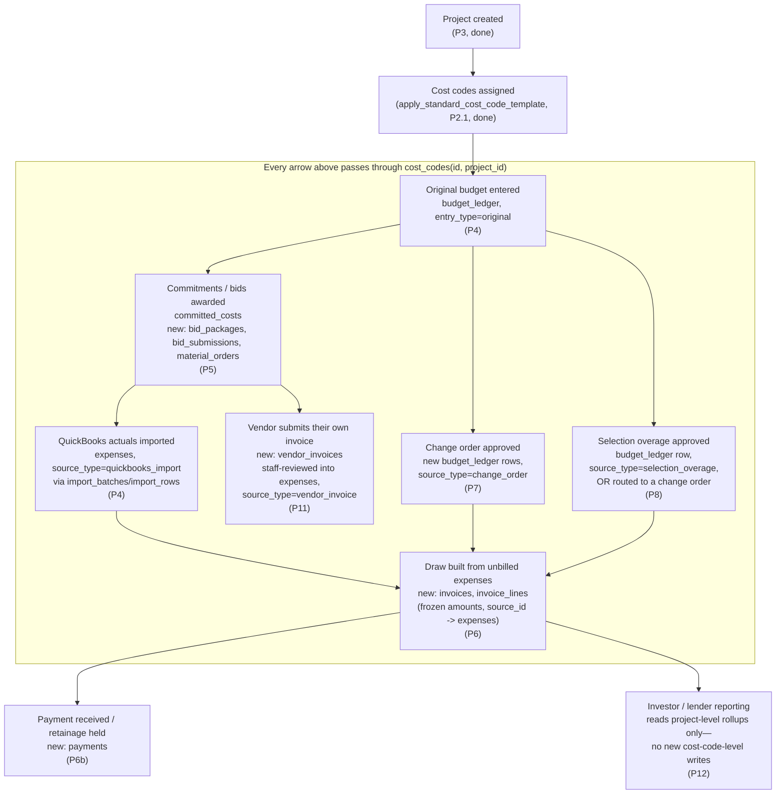

# Financial Architecture — The Project + Cost Code Ledger

**Status:** Standing architectural record, permanent as of 2026-08-06.
Required reading before any package from P4 onward touches money.
Referenced from `CLAUDE.md`'s non-negotiables and
`PRODUCTION-ROADMAP.md`. This document doesn't implement anything — it
states the rule every future financial package must follow, and proves
(package by package) that the rule already holds against the schema
that exists today.

## The standing rule

**The project + cost-code ledger is the permanent financial backbone of
this application.** Every financial concept this product will ever
need — budgets, estimates, vendor quotes, commitments, purchase orders,
QuickBooks actuals, forecasts, change orders, selections, draws,
invoices, payments, retainage — ties back to one project and one cost
code through the schema's existing composite foreign key, or (for
things that are genuinely project-level, not line-item-level, like an
investor's stake) to the project alone. **No future package introduces
a second, parallel financial table that duplicates data already living
in this backbone.** New packages add new tables that *reference* the
backbone; they never re-store a number the backbone already owns.

## Source-of-truth ownership, by direction (owner decision, 2026-08-20)

Two systems, two domains, one explicit boundary — stated here because
every future estimating/QuickBooks package (P4.1 onward) must build
against this exact split, never blur it:

- **The portal is the source of truth for estimating and budgeting**:
  original and revised estimates, allowances, detailed cost-code
  breakdowns (parent + child, see P4.1), commitments, forecasts, and
  projected final cost. This was already true by construction — nothing
  in `schema/001`–`016` lets QuickBooks data write to `budget_ledger`,
  `forecast_entries`, or `committed_costs` — this section makes it an
  explicit, permanent product decision rather than an implicit
  consequence of what's been built so far.
- **QuickBooks Desktop Enterprise Contractor is the source of truth for
  accounting**: bills, checks, credit cards, payroll, invoices,
  payments, and actual job costs. The portal never recomputes or
  overrides a QuickBooks actual — `expenses` rows sourced from
  QuickBooks are a **reviewed, staff-confirmed copy** of what
  QuickBooks already recorded (`source_type='quickbooks_import'`), not
  an independent accounting entry.
- **Money flows both directions, for different reasons, through
  different controlled paths** — this is the one change from the
  pre-2026-08-20 framing (which described only inbound sync). Actuals
  flow **QuickBooks → portal** (P4's existing import pipeline,
  unchanged). Approved budget/estimate snapshots flow **portal →
  QuickBooks** (P4.4, planned, not yet designed — see "Planned: budget
  export to QuickBooks" below) so QuickBooks' own Job/Customer:Job
  reporting reflects the portal's approved numbers without a second,
  manually-retyped budget living in QuickBooks. **Neither direction is
  ever bidirectional live sync** — each is a discrete, reviewed,
  audited, one-way transfer at a specific moment (import-batch confirm;
  export-snapshot approval), matching the same "controlled, not
  automatic" posture P4's import already established.
- **No budget is ever editable in both systems.** Once a budget is
  exported to QuickBooks, QuickBooks' own copy is a report artifact,
  not a second editable original — the portal's own copy remains the
  only place a revision can originate, and re-export (never a
  QuickBooks-side edit reconciled backward) is how QuickBooks' copy
  stays current. This is the same "one source of truth per fact, never
  two editable copies" rule the whole backbone already runs on,
  restated for the export direction specifically.

## The backbone, as it exists today

Anchor: **`cost_codes`** (`id, project_id`, unique together). Every
table below carries the same composite FK shape —
`foreign key (cost_code_id, project_id) references cost_codes(id, project_id)`
— which is what makes "every dollar traces to one project and one cost
code" a schema-enforced fact, not a convention someone could forget:

| Table | What it records | Introduced |
|---|---|---|
| `cost_codes` | The 113-code, 7-division structure every dollar is coded against | 001, extended 012 |
| `budget_ledger` | Original estimate, approved changes, corrections — append-only | 001 |
| `expenses` | Actual costs (manual, QuickBooks-imported, vendor-invoiced) | 001 |
| `committed_costs` | Money obligated but not yet spent (POs, subcontracts) | 001 |
| `forecast_entries` | Forecast-to-complete per cost code | 001 |
| `fee_ledger` | Builder fee accrual/billing events | 001 |
| `budget_suggestions` | System-suggested budget adjustments (never auto-applied) | 001 |
| `import_batches` / `import_rows` | QuickBooks file-import staging and review | 001 (activated P4) |
| `import_mapping_profiles` | Reusable QB column/cost-code mapping rules | P4 |

## How money flows, project creation through final payment

**Narrative, stage by stage:**

1. **Project + cost codes** (done) — `projects`, `cost_codes` seeded from
   the standard template. Every later row's `(cost_code_id, project_id)`
   points back here.
2. **Original budget** (P4) — one `budget_ledger` row per cost code,
   `entry_type='original'`.
3. **Commitments/bids** (P5) — `committed_costs` (already schema-hardened,
   never exercised by UI); new `bid_packages`/`bid_submissions` are the
   vendor-quote mechanism — **"vendor quotes" is not a separate future
   table, it's `bid_submissions`**, avoiding a redundant parallel
   concept. An awarded bid becomes a `committed_costs` row with
   `source_type='bid_award'`, `source_id=bid_submissions.id`.
4. **QuickBooks actuals** (P4) — `import_batches`/`import_rows` stage the
   file; confirmed rows become `expenses` with
   `source_type='quickbooks_import'`, `import_batch_id` set.
5. **Vendor-submitted invoices** (P11) — same pattern as step 4: staff
   review turns a `vendor_invoices` row into an `expenses` row,
   `source_type='vendor_invoice'`. P11 does not need its own actuals
   table — it feeds the same one QuickBooks imports feed.
6. **Change orders** (P7) — one or more new `budget_ledger` rows (a
   change order touching four cost codes produces four rows, one per
   code, all sharing `source_id=change_orders.id`) —
   `budget_ledger`'s per-row cost-code shape already supports this with
   zero schema change.
7. **Selections** (P8) — an approved overage becomes either a
   `budget_ledger` row (`source_type='selection_overage'`) or is routed
   into a change order, per the project's existing change-order
   workflow — never a third, separate "selections ledger."
8. **Draws/invoices** (P6) — new `invoices`/`invoice_lines`.
   `invoice_lines` carries the same `(cost_code_id, project_id)` FK
   plus `source_type`/`source_id` pointing at the specific `expenses`
   row(s) it bills, with its **own frozen `amount_cents`** (never a
   live pointer) — this is what "a draw never moves after issue" means
   in schema terms, the same append-only philosophy already used
   everywhere else. "Which expenses are already billed" is answered by
   querying `invoice_lines` for a matching `source_id`, never by adding
   a `billed` column to `expenses` — this is the one governing
   convention P6 must follow to avoid needing to touch `expenses` again.
9. **Payments/retainage** (P6b) — new `payments` (and, if a payment can
   span multiple invoices, `payment_allocations`), referencing
   `invoices`. Retainage-held/released amounts live as columns on these
   new tables, not on anything upstream.
10. **Investor/lender reporting** (P12) — reads project-level rollups
    (`computeProjectTotals`, draws) and adds `investor_project_stakes`/
    `lender_draw_requests` — project-scoped, not cost-code-scoped (an
    investor's stake isn't tied to one cost code), so these key off
    `project_id` alone, not the composite FK.
11. **Company reporting** (P14) — reads across everything above; writes
    nothing new.

## Traceability: the `source_type` registry

`budget_ledger.source_type`/`source_id` and `committed_costs.source_type`/
`source_id` are deliberately untyped (`text`/`uuid`, no FK, no CHECK) —
this is what lets every future package plug in without a migration to
the column itself. The trade-off is that nothing stops two packages
from inventing inconsistent strings for the same concept. **This table
is the single registry — every new `source_type` value gets added here
in the same commit that introduces it, never invented ad hoc:**

| `source_type` value | Table(s) | Meaning | Introduced |
|---|---|---|---|
| `manual` | `expenses` | Hand-entered by staff | 001 (existing default) |
| `quickbooks_import` | `expenses` | Confirmed from an `import_batches` row | P4 |
| `bid_award` | `committed_costs` | Created from an awarded `bid_submissions` row | P5 |
| `material_order` | `committed_costs` | Created from a committed `material_orders` row (`commit_material_order()`) — **one order may produce multiple rows sharing the same `source_id`, one per distinct cost code among its line items**, the same multi-row-per-event shape `change_order` (below) already uses; `source_id` was never a promise of exactly one row | P5 |
| `change_order` | `budget_ledger` | Approved change order | P7 (slot already reserved, per `PRODUCTION-ROADMAP.md`'s P7 section) |
| `selection_overage` | `budget_ledger` | Approved selection over allowance | P8 |
| `vendor_invoice` | `expenses` | Confirmed from a vendor-submitted `vendor_invoices` row | P11 |
| `reversal_adjustment` | `fee_ledger` | Already a closed CHECK-constrained value, listed here for completeness, not open text | 001 |

Any package introducing a new financial event type adds its row here
in the same PR that adds the schema/code using it.

## Confirmation: P5 through at least P13 need no redesign of the existing backbone

Checked against every remaining financial package in
`PRODUCTION-ROADMAP.md`:

- **P5 (Commitments/Bids/Procurement):** new tables only
  (`bid_packages`, `bid_submissions`, `bid_questions`, `bid_addenda`,
  `material_orders`, `material_order_line_items`), each following the
  composite-FK pattern where line-item-scoped. `committed_costs` (001)
  already exists and needs no structural change — P5 activates it, per
  `PRODUCTION-ROADMAP.md`'s own framing.
- **P6 (Draws/Payments/Retainage):** new `invoices`/`invoice_lines`.
  Requires the one governing convention above ("billed" status lives in
  `invoice_lines`, never a new column on `expenses`) — not a schema
  redesign, a design constraint this document now makes explicit so P6
  doesn't invent a different, incompatible approach.
- **P6b (Payment Processing):** new `payments`/
  `payment_provider_transactions` (already named in
  `PRODUCTION-ROADMAP.md`). No change to the backbone.
- **P7 (Change Orders):** new `change_orders`/`field_directives`; wires
  the already-reserved `budget_ledger.source_type='change_order'` slot.
  No schema change to `budget_ledger` itself.
- **P8 (Selections):** new `selections`/`selection_approvals`. Overage
  handling reuses `budget_ledger`'s existing `source_type` mechanism.
- **P11 (Vendor Portal):** new `vendor_profiles`, `vendor_assignments`,
  `vendor_compliance`, `vendor_performance_notes`, `vendor_invoices`,
  `vendor_change_requests`. Vendor-submitted actuals feed `expenses`
  through the exact same staff-review-then-create pattern P4
  establishes for QuickBooks — proof the pattern generalizes, not a
  one-off.
- **P12 (Investor/Lender):** new `investors`, `investor_project_stakes`,
  `lender_draw_requests` — project-scoped, read the existing rollups,
  add no cost-code-level writes.

**The one honest caveat, not glossed over:** `fee_ledger.source_type` is
a *closed* CHECK constraint (`'expense_accrual' | 'invoice_issued' |
'reversal_adjustment'`), unlike the open text columns on `budget_ledger`/
`committed_costs`. If a genuinely new fee-triggering event type is ever
introduced (none is currently planned in P5–P14), it requires a small,
ordinary additive migration (`alter table ... drop constraint ... add
constraint ...` with the new value included) — this is normal forward
schema evolution, not a redesign, and is flagged here so it's a known,
planned-for possibility rather than a surprise.

Every other addition described above is a **new table plus a foreign
key into the existing backbone** — never an alteration to
`budget_ledger`, `expenses`, `committed_costs`, `forecast_entries`, or
`cost_codes`'s core shape.

## Detailed budget foundation (P4.1) — confirmed to satisfy the owner's requirement, no redesign needed

The owner's 2026-08-20 "detailed budget foundation" requirement
(canonical parent cost code + project-specific, renameable, reorderable,
archivable child breakdown items, each with its own scope/original-
revised-budget/commitments/actual-costs/forecast, parent rollup,
unallocated-by-default) is **already the exact shape**
`docs/production-build/P4.1-DESIGN.md` designed on 2026-08-15 — a new
`cost_code_children` table plus a nullable `cost_code_child_id` column
(with the same composite-FK pattern) on `budget_ledger`, `expenses`,
`committed_costs`, `forecast_entries`, `bid_packages`, and
`material_order_line_items`. No redesign is needed; P4.1 remains design-
only and unimplemented, its own approval and sequencing tracked in
`PRODUCTION-ROADMAP.md`, not restated here.

## Planned: budget export to QuickBooks (P4.4, not yet designed)

Recorded here now, ahead of P4.4's own design pass, as the constraint
that design must satisfy — not a schema proposal:

- **What's exported**: an approved budget/estimate **snapshot**, never
  a draft, never a live query result recomputed at read time — matching
  `issued_documents` (P5)'s own "immutable, versioned snapshot" pattern,
  the closest existing precedent in this codebase for "freeze a
  point-in-time financial artifact and keep the exact bytes that
  produced it reproducible later."
- **What's mapped**: each *parent* cost code needs an explicit mapping
  to a QuickBooks item/account (a new, small mapping table, org- or
  project-scoped — shape TBD by P4.4's own design). A child (P4.1) only
  appears as its own QuickBooks line if an equivalent QuickBooks item
  exists for it; otherwise its dollars roll into the mapped parent for
  export purposes only — **the portal's own child-level detail is never
  lost or overwritten by this rollup**, only the QuickBooks-side
  representation is coarser than the portal's.
- **A new table for export history** (name/shape TBD by P4.4): user,
  timestamp, project, budget version, mapping version, output artifact,
  and result — additive to the backbone, referencing it via the same
  `source_type`/`source_id` convention every other package uses, never
  a parallel financial model. Idempotency (the same approved snapshot
  never double-exports) and pre-export validation/post-import
  reconciliation are P4.4 acceptance-criteria concerns, not schema
  concerns this document needs to settle now.
- **The one undecided, evidence-gated question**: whether the correct
  QuickBooks target is a QuickBooks **Estimate**, a job-specific
  QuickBooks **Budget**, or both for distinct reporting purposes. This
  is explicitly **not** a decision this document — or any design
  written before P4.4 begins — should guess at. P4.4's own design pass
  must first inspect Stone Column's actual QuickBooks Desktop
  Enterprise Contractor setup (or a representative export) the same way
  `WORKBOOK-GAP-ANALYSIS.md` inspected the real cost-plus workbook
  before P2.1 was designed — precedent, not a new pattern.

## Planned: historical pricing intelligence & tiered pricing (P4.2/P4.3, not yet designed)

Also recorded now as a constraint for later design, not a schema
proposal:

- **Historical pricing intelligence (P4.2) is a read-only analytical
  layer over the existing backbone — it introduces no new source of
  truth for any dollar amount.** It reads `budget_ledger` (original/
  revised estimates), `bid_submissions` (vendor bids, P5), `committed_costs`
  (POs/commitments), and `expenses` (QuickBooks actuals) — exactly the
  tables that already exist — grouped by cost code/child item, project
  type, location, size, and completion date, to surface averages,
  ranges, most-recent cost, and source provenance. It never writes back
  into `budget_ledger` or any other backbone table on its own; every
  suggested number remains subject to the same standing rule already in
  `CLAUDE.md`: **suggested numbers are never official until a human
  accepts or edits them** — the existing `budget_suggestions` table
  (already built, already governed by that rule) is the natural landing
  spot for a historical-pricing-derived suggestion, not a new table
  that reinvents "suggestion, not fact."
- **Tiered pricing (Value/Standard/Premium, P4.3) is a per-cost-item
  (or per-child-item) selector, never a whole-project multiplier field**
  — per the owner's explicit requirement. This means it's naturally
  expressed as an attribute on whatever P4.1's `cost_code_children`
  design lands on for a project's line items, not a new top-level
  `projects.pricing_tier` column that would apply uniformly. P4.3's own
  design must confirm the exact attachment point once P4.1 is
  implemented and real child-item rows exist to attach a tier to.

## What this document is not

Not a replacement for each package's own `P{N}-DESIGN.md` — those still
carry the full scope/RLS/test detail for their package. This document
is the cross-package constraint those designs must satisfy, checked
once here so no individual package has to re-derive it.
